# Анализ туристических данных Новой Зеландии

## Описание проекта
Данный проект посвящен анализу туристических потоков в Новую Зеландию за период 1979-2024 годы. В ходе исследования были изучены основные показатели туристической активности, проведен корреляционный анализ и визуализация данных.

## Структура репозитория
- `Лаба1ML.ipynb` - основной ноутбук с анализом данных
- `NZ Tourism-forecasts data.csv` - датасет с туристическими показателями
- `images/` - папка с сохраненными графиками

## Основные характеристики датасета

| Характеристика | Значение |
|----------------|----------|
| Период данных | 1979-2024 гг. |
| Количество строк | 644 |
| Количество стобцов | 11 |
| Основные показатели | Business Visitors, Holiday Visitors, Average Length of Stay, Total Visitor Spend, Spend Per Day, Total Visitor Days, Total Visitor Arrivals, VFR |

## Используемые библиотеки
```python
import numpy as np
import pandas as pd
import seaborn as sns
import matplotlib.pyplot as plt
sns.set(style="ticks")
```

## Содержание ноутбука

### 1. Загрузка и первичный анализ данных
```python
# Загрузка датасета
data = pd.read_csv('/var/data/NZ Tourism-forecasts data.csv', sep=",")

# Первые 10 строк датасета
data.head(10)

# Размер датасета
data.shape
total_count = data.shape[0]
print('Всего строк: {}'.format(total_count))

# Список колонок
data.columns

# Типы данных
data.dtypes
```

### 2. Текстовое описание набора данных
- **Источник данных:** Статистика туризма Новой Зеландии
- **Описание признаков:** деловые визиты, туристические визиты, длина пребывания, траты в день, страны.
- **Страны в датасете:** Australia, China, USA, UK, Japan, Germany.

```python
# Уникальные значения целевого признака
data['Country'].unique()
```

### 3. Основные статистические характеристики
```python
# Проверка наличия пустых значений
for col in data.columns:
    temp_null_count = data[data[col].isnull()].shape[0]
    print('{} - {}'.format(col, temp_null_count))

# Описательная статистика
data.describe()
```

### 4. Визуальное исследование датасета

#### Гистограммы
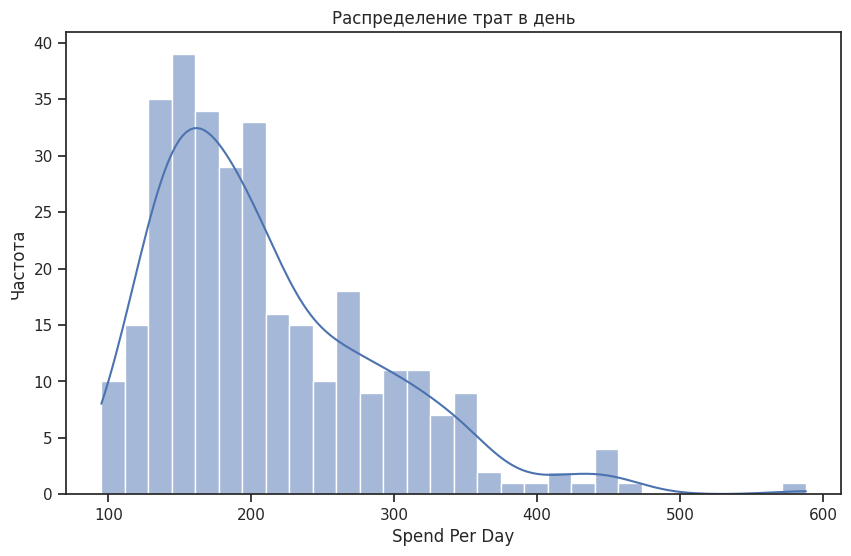

```python
# Распределение трат в день
fig, ax = plt.subplots(figsize=(10,6))
sns.histplot(data=data, x='Spend Per Day', bins=30, kde=True)
plt.title('Распределение трат в день')
plt.xlabel('Spend Per Day')
plt.ylabel('Частота')
plt.show()
```

#### Scatter plots (диаграммы рассеивания)
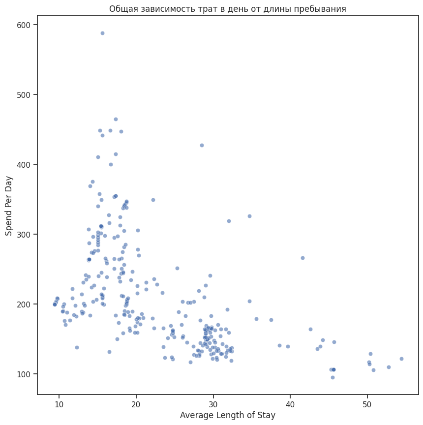
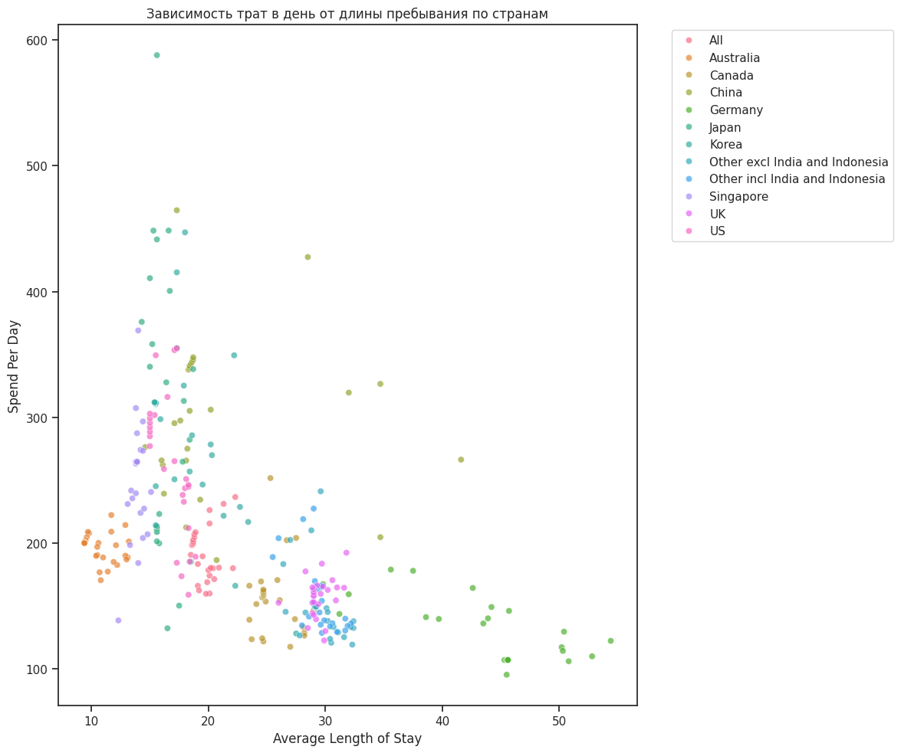
```python
# Общая зависимость
fig, ax = plt.subplots(figsize=(10,10))
sns.scatterplot(ax=ax, x='Average Length of Stay', y='Spend Per Day',
                data=data[data['Spend Per Day'].notna()], alpha=0.6)
plt.title('Общая зависимость трат в день от длины пребывания')
plt.show()

# По странам
fig, ax = plt.subplots(figsize=(12,10))
sns.scatterplot(ax=ax, x='Average Length of Stay', y='Spend Per Day',
                data=data[data['Spend Per Day'].notna()],
                hue='Country', alpha=0.7)
plt.title('Зависимость трат в день от длины пребывания по странам')
plt.legend(bbox_to_anchor=(1.05, 1), loc='upper left')
plt.tight_layout()
plt.show()
```

#### Joint plots (объединенные графики)
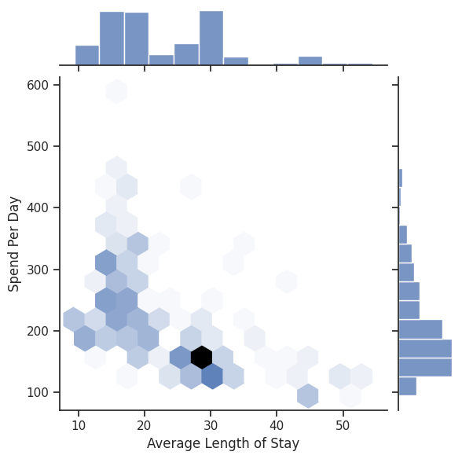
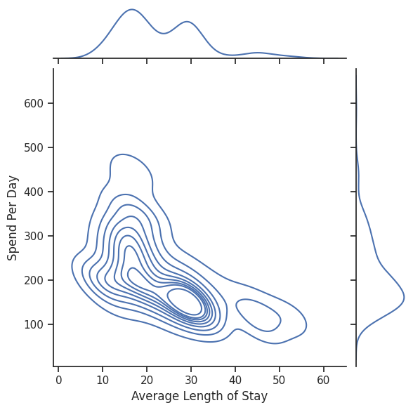

```python
# Базовый jointplot
sns.jointplot(x='Average Length of Stay', y='Spend Per Day',
              data=data[data['Spend Per Day'].notna()])
plt.show()

# Hexbin jointplot
sns.jointplot(x='Average Length of Stay', y='Spend Per Day',
              data=data[data['Spend Per Day'].notna()],
              kind="hex")
plt.show()

# KDE jointplot
sns.jointplot(x='Average Length of Stay', y='Spend Per Day',
              data=data[data['Spend Per Day'].notna()],
              kind="kde")
plt.show()
```

#### Pair plots (матрица графиков)


```python
# Все признаки
sns.pairplot(data)

# С разбивкой по странам
sns.pairplot(data, hue="Country")
```

#### Box plots (ящики с усами)
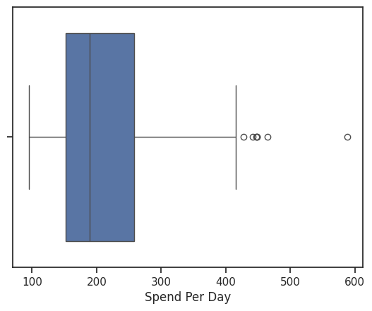
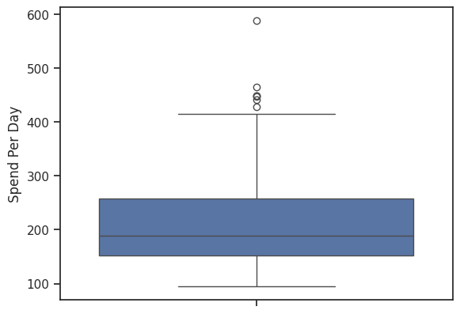
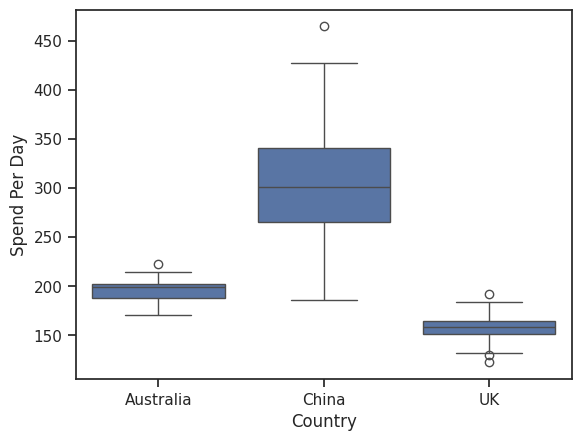
```python
# Вертикальный
sns.boxplot(x=data['Spend Per Day'])

# Горизонтальный
sns.boxplot(y=data['Spend Per Day'])

# По странам
sns.boxplot(data=data[data['Country'].isin(['Australia', 'China', 'UK'])],
            x='Country', y='Spend Per Day')
```

#### Violin plots
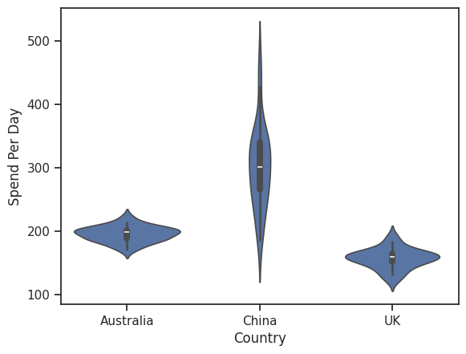
```python
# Базовый
sns.violinplot(x=data['Spend Per Day'])

# По странам
sns.violinplot(data=data[data['Country'].isin(['Australia', 'China', 'UK']) & data['Spend Per Day'].notna()],
               x='Country', y='Spend Per Day')

# Catplot с split
sns.catplot(data=data[data['Country'].isin(['Australia', 'China', 'UK']) & data['Spend Per Day'].notna()],
            y='Spend Per Day', x='Country', kind="violin", split=True)
```

### 5. Корреляционный анализ

#### Матрицы корреляций
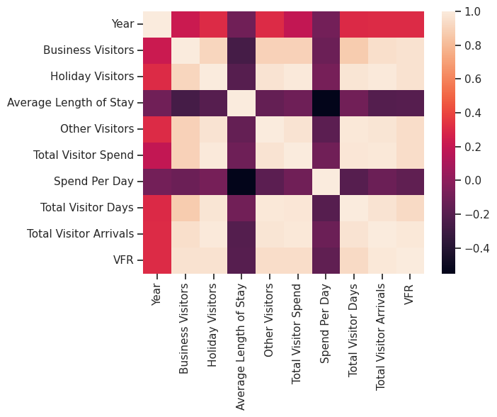
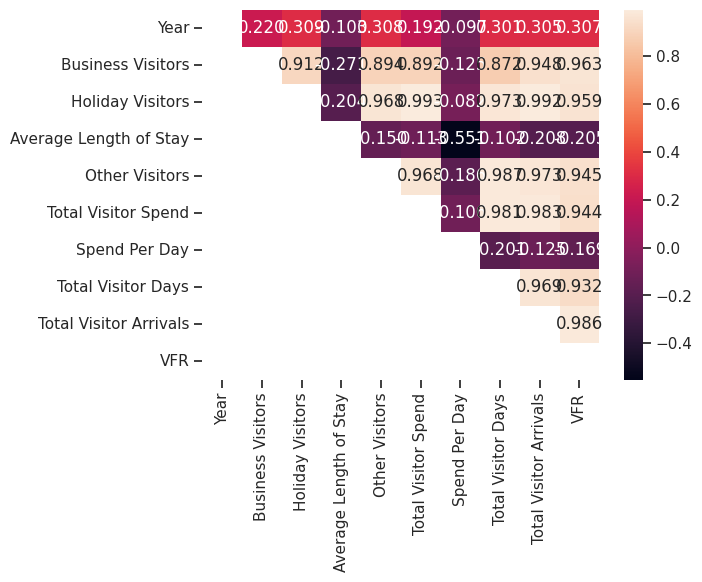


```python
# Базовая корреляция (только числа)
data.corr(numeric_only=True)

# Разные методы
data.corr(numeric_only=True, method='pearson')
data.corr(method='kendall', numeric_only=True)
data.corr(method='spearman', numeric_only=True)
```

#### Тепловые карты
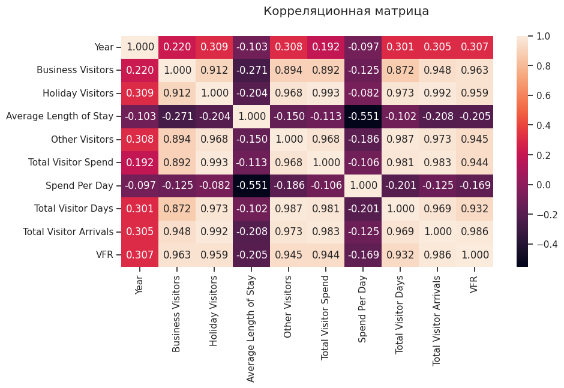

```python
# Базовая тепловая карта
sns.heatmap(data.corr(numeric_only=True))

# С значениями
sns.heatmap(data.corr(numeric_only=True), annot=True, fmt='.3f')

# С цветовой схемой
sns.heatmap(data.corr(numeric_only=True), cmap='YlGnBu', annot=True, fmt='.3f')

# Треугольный вариант
mask = np.zeros_like(data.corr(numeric_only=True), dtype=np.bool)
mask[np.tril_indices_from(mask)] = True
sns.heatmap(data.corr(numeric_only=True), mask=mask, annot=True, fmt='.3f')
```

#### Сравнение методов корреляции
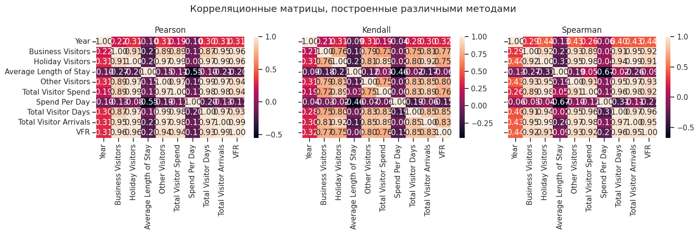
```python
fig, ax = plt.subplots(1, 3, sharex='col', sharey='row', figsize=(15,5))

sns.heatmap(data.corr(method='pearson', numeric_only=True), ax=ax[0], annot=True, fmt='.2f')
sns.heatmap(data.corr(method='kendall', numeric_only=True), ax=ax[1], annot=True, fmt='.2f')
sns.heatmap(data.corr(method='spearman', numeric_only=True), ax=ax[2], annot=True, fmt='.2f')

fig.suptitle('Корреляционные матрицы, построенные различными методами')
ax[0].title.set_text('Pearson')
ax[1].title.set_text('Kendall')
ax[2].title.set_text('Spearman')

plt.tight_layout()
plt.show()

# Финальная корреляционная матрица
fig, ax = plt.subplots(1, 1, sharex='col', sharey='row', figsize=(10,5))
fig.suptitle('Корреляционная матрица')
sns.heatmap(data.corr(numeric_only=True), ax=ax, annot=True, fmt='.3f')
```

## Основные выводы

## Корреляционный анализ

### Общие выводы по корреляциям

На основе анализа корреляционной матрицы можно сделать следующие выводы:

- **Рост количества туристов** (особенно туристических визитов) напрямую приводит к росту общих трат
- **Деловые и туристические визиты сильно взаимосвязаны** - страны с высоким турпотоком также имеют много деловых визитов
- Существует **слабая отрицательная связь между длиной пребывания и тратами в день** - туристы, которые остаются дольше, тратят меньше в день (экономия на длительных поездках)


Эти корреляции можно использовать для:

- **Прогнозирования доходов** от туризма на основе данных о въездах
- **Определения ключевых драйверов** туристической активности
- **Сегментации стран** по паттернам поведения туристов

---

### Анализ зависимости трат от длины пребывания по странам

На основе диаграммы рассеивания "Зависимость трат в день от длины пребывания по странам" можно сделать следующие выводы:

На графике наблюдается **отрицательная зависимость** между длиной пребывания и тратами в день для большинства стран. Чем дольше туристы остаются в Новой Зеландии, тем меньше они тратят в среднем за день.

| Группа стран | Страны | Траты в день | Длина пребывания |
|--------------|--------|---------------|-------------------|
| Высокие траты, короткое пребывание | Китай, США | $400-600 | 10-20 дней |
| Средние траты, среднее пребывание | Великобритания, Германия, Япония | $200-400 | 15-30 дней |
| Низкие траты, длительное пребывание | Австралия, Канада | $150-250 | 20-40 дней |
| Усредненные показатели | All    | Средние значения по датасету | Средние значения  |

---

### Анализ ящиков с усами (Box plots) по странам

На основе ящиков с усами для трех стран (Австралия, Китай, Великобритания) можно сделать следующие выводы:

#### Австралия (Australia)
- **Самая низкая медиана (190)** - австралийские туристы тратят меньше всех
- **Самый компактный размах (50)** - траты очень стабильны, почти все туристы тратят похожие суммы
- **Отсутствие выбросов** - все значения укладываются в рамки

#### Китай (China)
- **Самая высокая медиана (250)** - китайские туристы тратят больше всех
- **Самый большой размах (180)** - большой разброс в тратах
- **Наличие выбросов (до 390)** - есть очень прибыльные туристы

#### Великобритания (UK)
- **Средняя медиана (195)** - близка к австралийской
- **Средний размах (140)** - умеренный разброс
- **Нет сильных выбросов** - распределение достаточно равномерное

### Характеристика рынков

| Рынок | Характеристика | Особенности |
|-------|----------------|-------------|
| **Австралия** | Самый предсказуемый | Узкий ящик, короткие усы, минимальная вариативность, идеален для планирования |
| **Китай** | Самый неоднородный | Широкий ящик, длинные усы, большой разброс от эконом до премиум, требует сегментации |
| **Великобритания** | Сбалансированный | Средние показатели, умеренная вариативность, хороший индикатор общего тренда |

---

### Анализ корреляционной матрицы (тепловая карта)

#### 1. Группы сильно коррелирующих признаков

**Группа 1: Показатели туристического потока (корреляция 0.90-0.99)**
- **Рост числа туристов напрямую ведет к росту общих трат и количества дней пребывания**

**Группа 2: Показатели деловых визитов (корреляция 0.89-0.96)**
- **Деловые визиты тесно связаны с визитами к друзьям/родственникам**
- **Бизнес-туристы также приносят значительный доход**

#### 2. Умеренные корреляции
- **Наблюдается слабый положительный тренд роста туризма по годам** (рост около 0.3 за период)

#### 3. Отрицательные корреляции
- **Чем дольше туристы остаются, тем меньше они тратят в день** - самая сильная отрицательная связь в датасете

## Автор
diarovaarina32-sketch

## Дата создания
Март 2026
